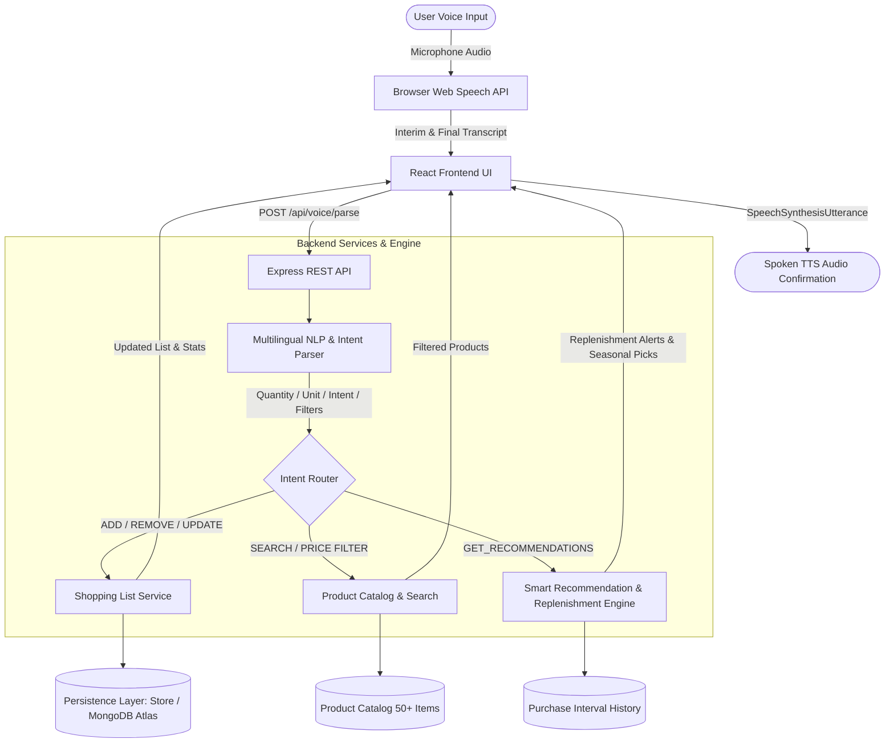

# Shopora – Voice Command Shopping Assistant

> **"Your Shopping List, Just One Voice Away."**
> A production-quality, responsive web application empowering users to manage grocery lists, search catalogs with natural price filtering, receive purchase-cycle replenishment recommendations, and explore dietary substitutions using spoken voice commands.

---

## Assessment Approach (Under 200 Words)

Modern grocery shopping applications create high cognitive friction through repetitive manual typing, complex sub-menus, and fragmented navigation. **Shopora** solves this through a voice-first, multimodal shopping assistant that pairs browser-native speech recognition with an intelligent hybrid NLP intent parser.

The frontend is built with React 18, Vite, TypeScript, and Tailwind CSS, featuring an accessible audio visualizer, real-time interim transcription, and responsive category grouping. The backend runs on Node.js and Express with a dual-tier persistence layer (in-memory + MongoDB Atlas Mongoose schemas). 

Our natural language engine normalizes quantities, units, and price thresholds across English, Hindi, Hinglish, and Spanish with deterministic reliability and zero required API keys. A predictive recommendation engine analyzes historical purchase cycles (e.g. Milk bought every 4 days) to deliver actionable replenishment alerts with explicit reasoning. For dietary restrictions or unavailable inventory, dynamic substitutions offer instant 1-click replacements. Shopora is fully responsive, container-ready, and deployable to Vercel and Render in minutes.

---

## System Architecture



---

## Key Features

-  **Multilingual Voice Recognition**: Real-time speech recognition in English, Hindi, Hinglish, and Spanish using the browser Web Speech API (`SpeechRecognition` / `webkitSpeechRecognition`).
-  **Smart Intent Extraction & Fallback Parser**: Deterministic regex and token normalizer extracting items, quantities, standard units (kg, litres, packets, dozen, boxes), price boundaries, and organic/dietary modifiers with optional AI endpoint fallback.
-  **Automated Categorization**: Instant auto-classification into 10 categories (Produce, Dairy, Bakery, Beverages, Snacks, Pantry, Meat, Personal Care, Household, Frozen).
-  **Intelligent Replenishment & Low-Stock Alerts**: Tracks purchase intervals and flags due items with transparent reasoning (*"🥛 You may be running low. Bought 4 times with an average 4-day cycle"*).
-  **Seasonal Picks & Dietary Substitutions**: Live calendar season-based recommendations (Summer, Monsoon, Winter) with "On Sale" badges and 1-click dietary/out-of-stock alternatives (e.g. Almond Milk for Dairy-free).
-  **Natural Voice Search & Price Filters**: Search items with natural language constraints (*"Find organic apples under 200 rupees"*, *"Show shampoo between 300 and 500"*).
-  **Dynamic Statistics Dashboard**: Live counts for total items, categories, completed items, and budget estimations against user-defined targets.
-  **Spoken TTS Feedback**: Real-time audio voice confirmations using `window.speechSynthesis` with instant mute toggle.
-  **Dark & Light Mode**: Accessible color contrast and smooth theme switching.
-  **Mobile-First & Accessible**: Bottom navigation, large touch targets, keyboard navigation, and ARIA labels.

---

## Tech Stack

| Layer | Technologies |
|---|---|
| **Frontend** | React 18, Vite 5, TypeScript, Tailwind CSS, Lucide React, Zustand |
| **Voice & Audio** | Web Speech API (`SpeechRecognition`, `SpeechSynthesis`), Audio Wave Visualizer |
| **Backend** | Node.js, Express, TypeScript, Vitest |
| **Persistence** | In-Memory Store with Sample Seed + MongoDB Mongoose Models |
| **NLP & AI** | Deterministic Multilingual Parser + Optional Gemini API Integration |

---

## Voice Commands to Try

| Intent | Voice Command (English) | Multilingual Alternative |
|---|---|---|
| **Add Item** | `"Add 2 bottles of milk"` | `"Meri list mein 2 kg apples add karo"` (Hinglish)<br>`"Agrega dos litros de leche"` (Spanish)<br>`"मेरी लिस्ट में दूध जोड़ो"` (Hindi) |
| **Quantity & Unit** | `"Add 3 packets of organic brown bread"` | `"Add one dozen eggs"` |
| **Remove Item** | `"Remove milk"` | `"Delete bananas from my list"` |
| **Update Item** | `"Change milk quantity to 3"` | `"Make oranges five"` |
| **Complete Item** | `"I bought the milk"` | `"Mark apples as completed"` |
| **Voice Search** | `"Find organic apples under 200 rupees"` | `"Find Colgate toothpaste"` |
| **Price Filtering** | `"Find shampoo between 300 and 500"` | `"Show products below 100"` |
| **Recommendations**| `"What should I buy?"` | `"Show recommendations"` |
| **Clear List** | `"Clear my shopping list"` | *(Prompts destructive action confirmation dialog)* |

---

## Project Structure

```
shopora/
├── backend/
│   ├── src/
│   │   ├── controllers/         # Voice, Shopping List, Product, Recommendations, History, Preferences
│   │   ├── services/            # NLP engine, Replenishment, Seasonal, Search, Shopping List
│   │   ├── models/              # TypeScript interfaces & Mongoose schemas
│   │   ├── data/                # 50+ Seeded products, purchase history, and in-memory store
│   │   ├── middleware/          # CORS, Error handler, Request logger
│   │   ├── routes/              # Express REST routes (/api/...)
│   │   ├── tests/               # Vitest automated test suite (NLP, Recommendations, Shopping List)
│   │   └── index.ts             # Express server entry point
│   ├── package.json
│   ├── tsconfig.json
│   └── .env.example
├── frontend/
│   ├── src/
│   │   ├── components/          # Navbar, VoiceAssistant, VoiceButton, TranscriptPanel, ShoppingList,
│   │   │                        # ProductSearch, RecommendationPanel, SubstituteModal, PreferencesModal...
│   │   ├── hooks/               # useSpeechRecognition, useSpeechSynthesis, useShoppingStore (Zustand)
│   │   ├── services/            # Axios API client
│   │   ├── types/               # Domain interfaces & Types
│   │   ├── App.tsx              # Main dashboard application
│   │   ├── main.tsx
│   │   └── index.css            # Tailwind styles & custom animations
│   ├── package.json
│   ├── vite.config.ts
│   ├── tailwind.config.js
│   └── index.html
├── README.md
└── .env.example
```

---

## Local Development & Setup

### Prerequisites
- Node.js (v18 or higher)
- npm or yarn

### 1. Clone & Install

```bash
# Clone the repository
git clone https://github.com/yourusername/shopora.git
cd shopora

# Install backend dependencies
cd backend
npm install

# Install frontend dependencies
cd ../frontend
npm install
```

### 2. Configure Environment Variables

```bash
# In backend/ directory
cp .env.example .env
```

Default configuration runs out-of-the-box with zero setup:
```env
PORT=5000
NODE_ENV=development
CLIENT_URL=http://localhost:5173
```

### 3. Run Locally

Open two terminals:

**Terminal 1 (Backend API):**
```bash
cd backend
npm run dev
# Server running at http://localhost:5000
```

**Terminal 2 (Frontend UI):**
```bash
cd frontend
npm run dev
# Client running at http://localhost:5173
```

---

## Running Automated Tests

Run the Vitest test suite in the backend:

```bash
cd backend
npm test
```

Test coverage includes:
- ✅ Natural language intent parsing for Add, Remove, Update, Complete, and Search
- ✅ Quantity & unit normalizations (word numbers, fractions, metric units)
- ✅ Multilingual commands (English, Hindi, Hinglish, Spanish)
- ✅ Automatic category assignment
- ✅ Historical replenishment interval calculation
- ✅ Seasonal detection and recommendations

---

## Deployment Guide

### Deploying Frontend (Vercel)
1. Push project to GitHub.
2. Import repository into [Vercel](https://vercel.com).
3. Set **Root Directory** to `frontend`.
4. Set Build Command to `npm run build` and Output Directory to `dist`.
5. Add Environment Variable:
   - `VITE_API_URL`: `https://your-backend-service.onrender.com/api`

### Deploying Backend (Render / Railway)
1. Create a Web Service on [Render](https://render.com) pointing to the `backend` folder.
2. Set Build Command to `npm install && npm run build`.
3. Set Start Command to `npm start`.
4. Add Environment Variables:
   - `PORT`: `5000`
   - `NODE_ENV`: `production`
   - `CLIENT_URL`: `https://your-frontend.vercel.app`
   - `MONGODB_URI`: *(Optional MongoDB Atlas Connection String)*

---

## Browser Compatibility

| Browser | Speech Recognition | Speech Synthesis | Fallback Support |
|---|---|---|---|
| **Google Chrome** | ✅ Supported | ✅ Supported | Full Voice & Audio |
| **Microsoft Edge** | ✅ Supported | ✅ Supported | Full Voice & Audio |
| **Brave** | ✅ Supported (allow permissions) | ✅ Supported | Full Voice & Audio |
| **Safari / iOS** | ⚠️ Partial (`webkitSpeechRecognition`) | ✅ Supported | Text & Simulation Fallback |
| **Firefox** | ❌ API flag required | ✅ Supported | Text & Simulation Fallback |

> *Note*: When speech recognition is blocked or unsupported, Shopora gracefully provides instant interactive sample voice prompt buttons and a manual command input so all functionality remains 100% accessible.

---

## License

MIT License © 2026 Shopora.
